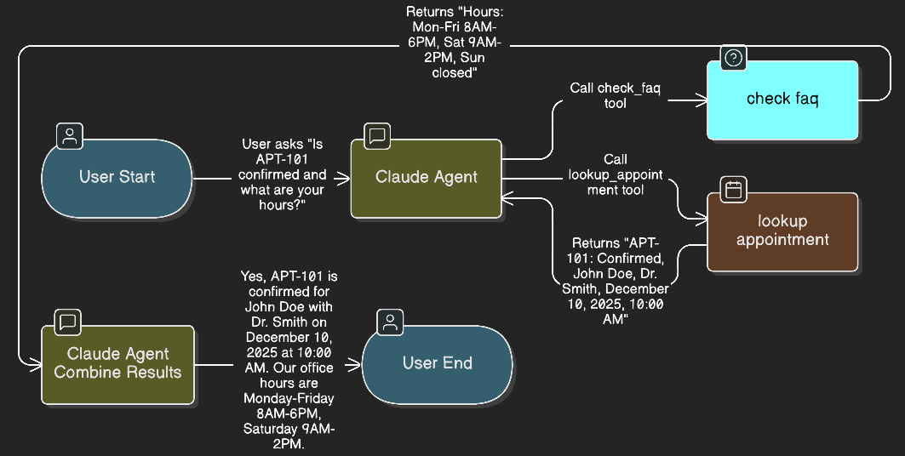
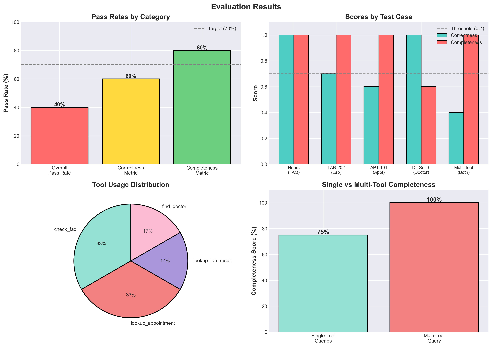

# Healthcare MCP Assistant

A healthcare query assistant demonstrating multi-tool orchestration using Claude API with function calling. The agent dynamically combines information from multiple data sources in a single query.

## Example: Multi-Tool Query Flow

**Query:** "Is APT-101 confirmed and what are your hours?"

**Response:** "Yes, APT-101 is confirmed for John Doe with Dr. Smith on December 10, 2025 at 10:00 AM. Our office hours are Monday-Friday 8AM-6PM, Saturday 9AM-2PM."



The agent automatically identifies the query requires two different data sources, calls the appropriate tools sequentially (`lookup_appointment` and `check_faq`), and combines the results into a coherent response.

## Available Tools

The system provides access to four healthcare data sources:

1. **check_faq** - General information (hours, location, insurance policies)
2. **lookup_appointment** - Appointment status and details
3. **lookup_lab_result** - Laboratory test results
4. **find_doctor** - Doctor availability and information

## Project Structure
```
healthcare-mcp-assistant/
├── src/
│   └── data.py                 # Healthcare data (FAQ, appointments, labs, doctors)
├── figures/
│   ├── mcp_diagram.png         # Query flow diagram
│   └── evaluation_results.png  # Evaluation metrics visualization
├── demo_claude.py              # Main implementation
├── evaluation.py               # DeepEval testing
├── evaluation_results.md       # Detailed evaluation report
└── requirements.txt
```

## Requirements
```
anthropic
python-dotenv
deepeval
```

## Setup

1. Install dependencies:
```bash
pip install -r requirements.txt
```

2. Add API key to `.env`:
```
ANTHROPIC_API_KEY=your-key-here
```

3. Run demo:
```bash
python demo_claude.py
```

## Evaluation Results

Evaluated using DeepEval framework with Claude Sonnet 4 as judge.



**Summary:**
- Completeness: 80% pass rate (4/5 tests)
- Multi-tool query: Perfect completeness score (1.0)
- Tool selection accuracy: 100%

The evaluation validates the core capability: successfully combining data from multiple tools in a single response.

[View detailed evaluation results](evaluation_results.md)

## Implementation Details

**Core Components:**

1. **Function Tools** - Python functions wrapped as tools:
   - `check_faq(question)` - FAQ lookup
   - `lookup_appointment(appointment_id)` - Appointment details
   - `lookup_lab_result(lab_id)` - Lab results
   - `find_doctor(doctor_name)` - Doctor information

2. **Agent Loop** - Handles multi-turn tool calling:
   - Agent calls tools as needed
   - Results fed back to agent
   - Continues until final response generated

3. **Evaluation** - DeepEval metrics:
   - Correctness: Factual accuracy
   - Completeness: All query parts answered

## Example Queries

**Single-tool:**
```
Q: "What are your hours?"
A: Monday-Friday 8AM-6PM, Saturday 9AM-2PM, Closed Sundays
```

**Multi-tool:**
```
Q: "Is APT-101 confirmed and what are your hours?"
A: [Combines appointment details + office hours]
```

## Cost & Performance

- Evaluation cost: $0.05 USD (5 queries)
- Average response time: ~6 seconds
- Evaluation model: Claude Sonnet 4

## License

MIT